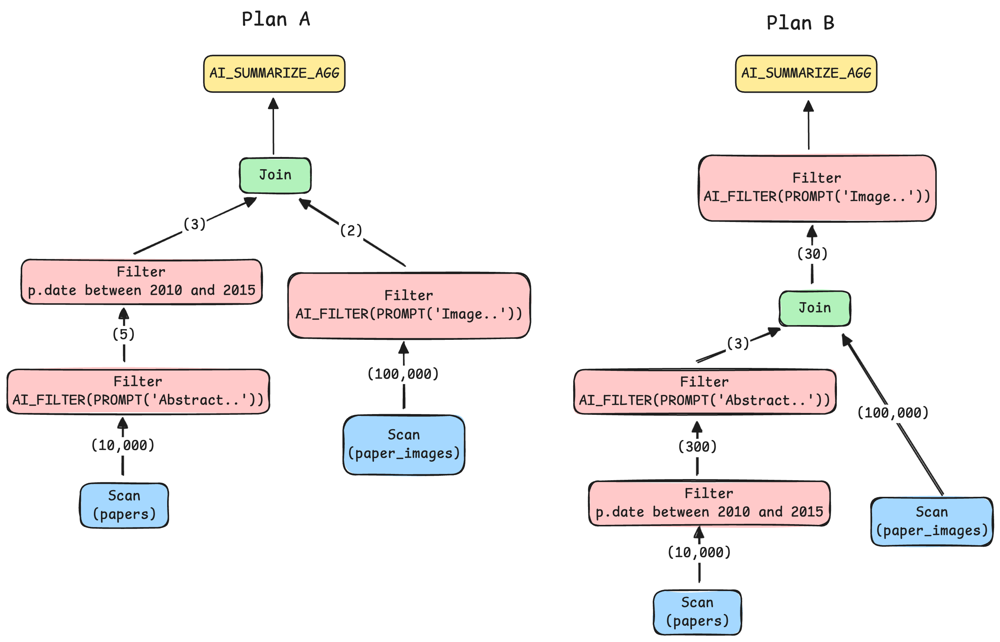
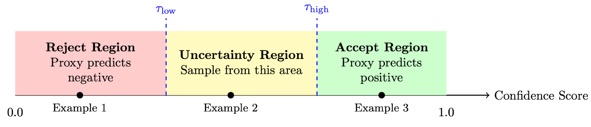
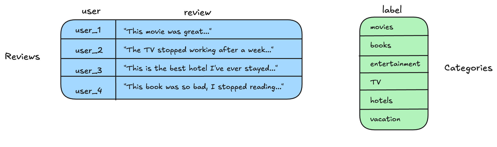
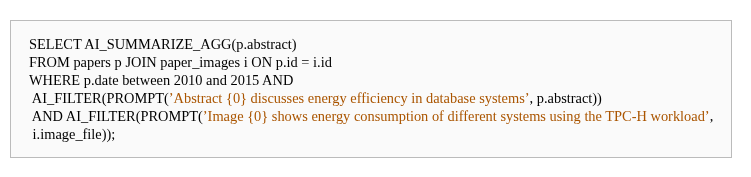
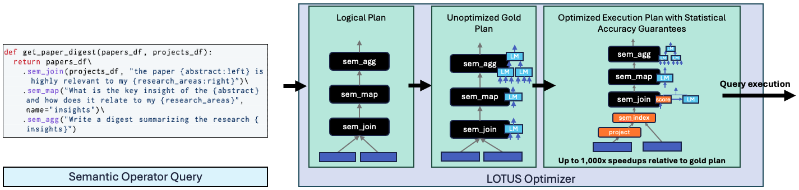
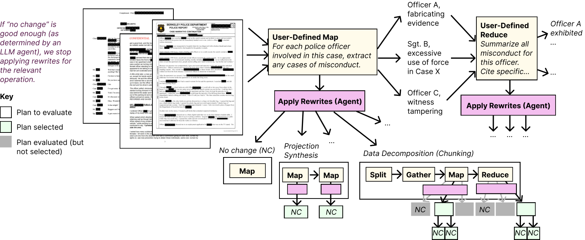

# AI SQL 中的查询优化：调研笔记

> 调研时间：2026-08
> 主题：AI Operator（语义算子）进入 SQL 执行计划后，优化器需要哪些新能力；工业界与学术界现状；开放问题。

---

## 1. 问题定义与价值判断

**结论：AI 算子的计划优化已成为工业系统中的实际需求，也正在受到学术界的持续关注。**

传统优化器建立在两个前提上：算子的成本/选择率可估计、算子语义是确定性的。AI 算子把两个前提都打破了：

- LLM 驱动的谓词代价比关系算子高几个数量级（一行 = 一次模型调用，毫秒到秒级，且有货币成本）；
- 其成本和选择率对优化器不透明，传统统计信息（直方图）完全失效；
- 套用传统启发式（如"谓词尽量下推"）会产生灾难性的计划。

**术语澄清："AI 算子" ≠ "LLM 调用"**。以 Cortex AISQL 的算子谱系为例，不同算子背后是成本、确定性完全不同的模型后端  [^47] [^48]：

| 后端类型 | 代表算子 | 性质 |
|---|---|---|
| 纯计算（无模型） | `JAROWINKLER_SIMILARITY`、`VECTOR_COSINE_SIMILARITY` 等字符串/向量函数 | 确定性、近零成本 |
| embedding 模型 | `AI_EMBED`、`AI_SIMILARITY`（默认 snowflake-arctic-embed-l-v2.0，图像用 voyage-multimodal-3） | 确定性、可物化、可走向量索引，成本远低于 LLM |
| LLM / 多模态大模型 | `AI_COMPLETE`、`AI_FILTER`、`AI_JOIN`、`AI_CLASSIFY`、`AI_AGG`、`AI_SUMMARIZE_AGG`、`AI_EXTRACT`、`AI_SENTIMENT` | 非确定性、成本主导、选择率不透明 |
| 专用任务模型 | `AI_TRANSLATE`、`AI_PARSE_DOCUMENT`（OCR）、`AI_TRANSCRIBE`、`AI_REDACT` | 介于两者之间 |

且同一逻辑算子内部还有实现层次：AI_FILTER 的模型级联让大部分行先走便宜的小代理模型，只有不确定样本升级到大 oracle 模型  [^1]。因此成本是**高度异构的谱系**（每行近零到美元级），非确定性只存在于 LLM 驱动的子集；优化器真正面对的是"每个算子选哪个后端 × 放在计划哪个位置"的联合问题。

Snowflake 在 Cortex AISQL 论文中明确将此定义为核心挑战：生产负载分析显示 AI 算子占据执行成本的主导份额，且近一半查询涉及多表操作，这直接驱动了他们做 join 优化和成本感知规划 [^6] 。

**核心研究问题**：一旦 AI 算子进入生产 SQL，优化器必须重新回答三类决策——

1. **placement（放置）**：把模型调用放在计划的哪个位置；

    例：Snowflake Cortex AISQL 的 Plan A vs Plan B
    ```sql
    SELECT AI_SUMMARIZE_AGG(p.abstract)
    FROM papers p JOIN paper_images i ON p.id = i.id
    WHERE p.date BETWEEN 2010 AND 2015 AND
      AI_FILTER(PROMPT('Abstract {0} discusses energy efficiency in database systems', p.abstract))
      AND AI_FILTER(PROMPT('Image {0} shows energy consumption of different systems using the TPC-H workload',
                       i.image_file));
    ```
    三个谓词的执行成本差异较大。日期谓词的成本相对可忽略，文本和图像 AI_FILTER 的成本依次增加。Plan A 将三个谓词均放置在 join 下方，需要约 110,000 次 LLM 调用；Plan B 调整谓词顺序，并将图像谓词放置在 join 上方，调用次数降至约 330 次，相差超过 300 倍[^1]。

    

2. **physical selection（物理实现选择）**：用哪个模型/实现/后端执行；

    例：Snowflake 自适应模型级联——同一逻辑 AI_FILTER 在 proxy 小模型和 oracle 大模型之间，根据运行期学习的双阈值进行路由（reject / uncertainty / accept 三个区域）[^15]：
    ```sql
    -- 筛出"客户情绪激动"的销售通话：
    SELECT transcript_id, sales_agent_id
    FROM sales_transcripts
    WHERE AI_FILTER(PROMPT('In this sales transcript, does the customer become irritated? {0}',
                       transcript));
    ```
    对每一行先使用 proxy 模型计算预测结果及置信度，仅将置信度位于不确定区间的样本交给 oracle 模型处理：

    

3. **rewriting（重写）**：是否可以改写为成本更低的等价或近似执行形式。

    例：Snowflake 语义 join → 多标签分类重写
    ```sql
    -- 把每条商品评论关联到一个或多个商品类目
    SELECT * FROM Reviews JOIN Categories
    ON AI_FILTER(PROMPT('Review {0} is mapped to category {1}',
                    Reviews.review, Categories.label));
    ```
    该语义连接条件不能直接使用面向等值连接的 hash join 或 sort-merge join；朴素实现需要通过 cross join 对候选元组逐对判断（下图 4 条评论 × 6 个类目 = 24 次调用）。编译期 AI oracle 判定该 join 可重述为多标签分类后，改写为对每条评论执行一次 AI_CLASSIFY，并以 Categories.label 的全量取值作为候选标签（4 次调用），复杂度从 O(M×N) 降为 O(M)[^1] [^15]。

    

> 术语口径：三个词分别对应优化器文献的经典概念——placement 出自谓词迁移（predicate migration，Hellerstein & Stonebraker, SIGMOD 1993）；physical selection 出自 Selinger 式优化器的物理算子选择（Selinger et al., SIGMOD 1979）；rewriting 出自查询重写（query rewriting）。将三者并列为 AI SQL 优化器需要重新回答的三类决策，是本文的归纳，各家论文原始表述并不统一。

### 1.1 研究进展总览

**工业界**：

- Snowflake 专文（arXiv 2511.07663）直陈："existing query engines are not designed to optimize semantic operations"，并围绕此重构优化器与执行引擎 [^1]；生产数据显示 AI 算子占查询成本主导、40% 查询多表——相关优化需求已经出现在生产负载中；
- BigQuery、Databricks、SQL Server 2025、AWS Redshift/Aurora 均在两年内把 AI 函数/算子接入 SQL。多数系统仍主要停留在函数接入层，但 AI 算子的执行效率已成为多个主流数据平台需要处理的问题。

**学术界**：

- 2024–2026 年 VLDB/SIGMOD/CIDR 持续出现相关工作，包括 Palimpzest、LOTUS、ThalamusDB、PLOP、Sema、DocETL/MOAR、CAESURA、CADENZA 等；
- 出现专门 benchmark（SemBench）与专门综述（《Semantic Data Processing with LLMs》，2026）——标志该领域从零散发文逐渐形成独立的研究方向 [^2] [^28]。

### 1.2 形式化定义

> **AI SQL 计划优化问题**：给定查询 Q = 关系算子 + 语义算子集合 {o₁,…,oₙ}（每个 oᵢ 带自然语言参数 φᵢ），求执行方案 p = ⟨T, π, ι, ρ⟩：
> - **T**：关系计划骨架（join 顺序、访问路径——传统部分）；
> - **π**：语义算子的放置与求值顺序（相对 join 的上拉/下推、谓词排序）；
> - **ι**：各语义算子的物理实现选择（后端 m ∈ {embedding, proxy, oracle, 专用模型}、级联阈值、批大小、缓存/物化开关）；
> - **ρ**：重写决策（如 join→分类）。
>
> **目标**：min C(p) = C_rel(p) + Σᵢ C_AI(oᵢ; π, ι)，s.t. 质量约束 Qual(p) ≥ τ（或在成本-质量-延迟 Pareto 前沿上选点）。
>
> 其中 Qual(p) 表示计划 p 执行结果的质量。传统代价优化通常假设候选物理计划在关系语义上等价，因此不需要将结果质量显式纳入目标函数。AI 算子下，ι 和 ρ 的某些选择可能改变结果质量或输出集合（例如，级联中的小模型可能误判部分行，join→分类重写会改变输出集合），因此结果质量需要显式进入目标函数。目前尚未形成统一的质量度量；部分系统采用相对于基准模型或标注结果的指标：Snowflake 级联使用相对于全量 oracle 大模型结果的 F1[^1] [^15]，DocETL 使用任务准确率；τ 表示用户可接受的质量下限，但 SQL 尚无语法声明它（见开放问题 5）。
>
> **与传统问题的本质区别**：C_AI 与 Qual 的输入量——选择率 σ(oᵢ)、单次成本 c(oᵢ,m)、错误率 ε(oᵢ,m)——不是可从 catalog 查到的统计量，而是**依赖数据分布与模型版本的未知随机变量**，只能在运行时观测。

即：这是一个**统计量未知、算子非确定、目标多维条件下的随机组合优化问题**；传统查询优化是它的特例（σ、c 已知，候选计划在关系语义上等价，ι 无质量维度）。

### 1.3 研究形态分类
**1.算子在 SQL 计划树内，有关系引擎**
| 系统                                | 形态                              |
| --------------------------------- | ------------------------------- |
| **Snowflake Cortex AISQL**        | 目前披露较为完整的工业系统：AI 算子作为一等算子进分布式 SQL 引擎，优化器参与 |
| **Google BigQuery**               | AI 函数内置进引擎                      |
| **Databricks AI Functions**       | SQL 内置函数（ai\_query 等）           |
| **SQL Server 2025 / Azure SQL**   | T-SQL 函数 + EXTERNAL MODEL       |
| **AWS Redshift/Aurora + Bedrock** | SQL 外部模型函数                      |
| **ThalamusDB**                    | 学术系统：带自然语言谓词的 SQL，多模态           |
| **PLOP**                          | 混合查询计划：关系计划树 + 语义算子（UDF 形态）     |
| **SIGMOD'25（SQL+LLM 联合优化）**       | 明确就是 SQL 执行优化                   |
| **Sema**                          | 语义查询引擎的自适应执行（SQL 语境）            |

例：SQL 语句里直接写 AI 算子（Snowflake 论文 Listing 1）：


**2.泛化管道/框架（自定义声明式接口，不是 SQL）**
| 系统                | 接口形态                                          |
| ----------------- | --------------------------------------------- |
| **DocETL / MOAR** | YAML DSL 管道（map/reduce/filter/resolve/gather） |
| **LOTUS**         | pandas 风格 dataframe API（sem\_filter 等）        |
| **Palimpzest**    | Python 声明式 API                                |
| **CAESURA**       | 自建算子 IR，LLM 当规划器                              |
| **AOP**           | LLM 流水线编排                                     |
| **CADENZA**       | NL 意图 → 算子 DAG                                |

例：

（1）自定义声明式接口：LOTUS 的 Pandas 风格语义算子 + 优化器（LOTUS 论文 Figure 1）：


（2）DocETL 的 YAML 管道 + agent 重写（DocETL 论文）：


### 1.4 AI 算子对查询优化流程的挑战

传统查询优化可以概括为：利用规则生成逻辑和物理候选计划，在计划空间中进行搜索，根据统计信息和代价模型评估候选计划，最后按优化目标选择执行计划。Rule-based 和 cost-based 并非两个完全独立的问题：前者定义可以生成哪些候选计划，后者负责评估和选择。AI 算子同时改变了这些环节的前提与决策空间。

**Ⅰ. 规则改写与语义正确性**

| # | 问题 | 现有做法 | 主要缺口 |
|---|---|---|---|
| C1 | **改写规则的覆盖范围与适用条件** | PLOP 用两条等价重写将语义算子的放置归约为 semantic filter placement [^18]；Snowflake 将部分 semantic join 重写为多标签分类 [^1] [^15]；DocETL/MOAR 用 rewrite directives 指导 agent 改写管道 [^50] | 现有规则分别面向特定算子或系统，尚未形成统一的语义代数、规则分类和适用条件判定机制 |
| C2 | **精确等价不足以描述部分 AI 改写** | PLOP 的归约保持结果等价；Snowflake 的 join→分类和 agent 生成的管道重写则可能改变结果分布 | 优化器需要区分精确重写与近似重写，并为后者定义可声明、可验证的质量边界 |

**Ⅱ. 计划空间与搜索**

| # | 问题 | 现有做法 | 主要缺口 |
|---|---|---|---|
| C3 | **计划空间从传统关系计划扩展为 T × π × ι × ρ**：除关系计划骨架 T（join 顺序、访问路径）外，还需考虑语义算子的放置与顺序 π、物理实现 ι（模型后端、级联阈值、批大小、缓存与物化）以及语义重写 ρ | PLOP 主要搜索 π；Palimpzest/Abacus 主要搜索 ι；Snowflake 分别处理谓词放置、模型级联和 join→分类重写；DocETL/MOAR 主要搜索 ρ | 现有方法大多只优化单个或少数维度，尚未统一处理不同维度的组合及其相互影响。例如，级联阈值会改变有效选择率，进而影响算子放置；语义重写也会改变基数、成本和结果质量 |
| C4 | **搜索效率与优化开销** | PLOP 使用 O(3ⁿ) 的动态规划搜索 placement [^9]；Palimpzest/Abacus 基于样本比较物理实现 [^1b]；MOAR 用多臂老虎机分配管道重写的搜索预算 [^50] | 各方法只覆盖部分计划维度；候选计划的生成、试跑和 AI oracle 评价本身也会产生费用，因此还需要决定搜索多少候选以及何时停止 |

**Ⅲ. 统计、代价与质量评估**

| # | 问题 | 现有做法 | 主要缺口 |
|---|---|---|---|
| C5 | **缺少面向 AI 算子的可复用统计信息** | 现有系统使用 token 数、distinct 输入数等代理量，或在样本上试跑以获取选择率、延迟和错误率（详见 3.7） | 这些信息依赖数据分布、prompt 和模型版本，且尚缺少类似传统统计目录的跨查询积累、失效和复用机制 |
| C6 | **代价模型对 AI 执行成本的覆盖不完整** | Snowflake 在编译期对推理成本做粗粒度估计并在运行期纠偏 [^1]；PLOP 联合计算 LLM 与关系算子成本 [^9]；Abacus 通过少量验证样本估计成本与延迟 [^1b] | 现有模型通常只覆盖货币成本、关系算子成本或延迟中的部分维度，对缓存、批处理、并发、排队和 rate limit 的联合影响考虑不足 |
| C7 | **质量估计与质量约束尚未标准化** | Snowflake 级联用相对 oracle 的 F1 衡量质量 [^1] [^15]；Palimpzest/Abacus 支持在成本、延迟和质量之间设置约束式目标 [^1b]；Sema 在精度约束下比较成本与延迟 [^19] | 质量指标因算子和任务而异，尚缺少通用的计划质量估计方法；SQL 也没有统一的查询级质量声明机制 |

> 质量在这里有两个不同作用：质量估计用于预测候选计划的 `Qual(p)`，与代价模型并列；用户给出的质量下限或偏好则属于优化目标或约束。因此，质量不宜简单折算进单一的货币代价；更可解释的形式是 `min C(p), s.t. Qual(p) ≥ τ`，或向用户提供成本-延迟-质量 Pareto 前沿。

**Ⅳ. 编译期与运行期协同**

| # | 问题 | 现有做法 | 主要缺口 |
|---|---|---|---|
| C8 | **编译期估计不足使部分决策依赖运行期反馈** | Snowflake 根据实测选择率动态调整谓词顺序，并在级联中在线学习阈值 [^1] [^15]；Sema 在运行期重排算子、融合语义操作并进行 prompt batching [^19] | 尚需明确哪些信息应在编译期估计、哪些决策应推迟到运行期，以及试跑规模、重优化时机和反馈信息的跨查询复用方法 |

**Ⅴ. 执行资源与系统语义**

| # | 问题 | 现有做法 | 主要缺口 |
|---|---|---|---|
| C9 | **模型服务资源尚未完整纳入计划决策** | BigQuery 按输入规模调整 LLM 并发资源，其 SemBench 结果显示了资源调度对大规模语义 join 的影响 [^2] | GPU 配额、批大小、推理并发、服务端排队和 API rate limit 会改变实际成本与延迟，传统 CPU、内存和 I/O 资源模型难以直接表达 |
| C10 | **非确定性执行下的可重复性与一致性** | function caching 和结果物化已被用于减少模型调用 [^12] [^31] | 缓存键和失效策略需要同时考虑 prompt、模型版本和数据更新；缓存复用与数据库事务语义之间的关系也尚未明确 |

**小结**：目前已有工作分别研究 AI 算子的规则改写、放置、物理实现、代价与质量估计以及运行期调整，但这些方法主要覆盖单个或少数环节。尚未形成同时覆盖规则、计划空间、统计与评估模型、搜索算法和运行期反馈的统一优化方法。

## 2. 工业界进展

整体格局：**几乎所有主流数据平台都在过去两年把 LLM 调用接进了 SQL，但"为 AI 算子做了查询处理层面技术"（无论计划层、算子层还是重写层）的目前是少数**。可以分成三档：

### 2.1 查询优化层面的深度改造（计划层 / 算子层 / 重写层）

- **Snowflake Cortex AISQL**：披露最完整，把 LLM 推理成本作为一等优化目标。主要技术包括 [^1] [^15]：
  - AI-aware 计划优化——编译期按成本排谓词求值顺序（传统谓词 → 文本 AI → 多模态 AI），运行期按实测选择率动态重排；AI 谓词相对 join 的上拉/下推按"LLM 总调用次数"而非行数决策（2x–8x 计划提升）；
  - 自适应模型级联——**仅限 AI_FILTER**（布尔输出才有干净的标量置信度，且 F1 可直接度量质量损失）。机制：proxy 小模型跑全量行并输出置信度，重要性采样在不确定区取子集送 oracle 打标，用集中不等式在线学出双阈值（accept / uncertainty / reject 三区），阈值随批次迭代精化 [^1] [^15]。实验（Llama3.1-8B proxy + Llama3.3-70B oracle，六个数据集）：平均 2.9x 加速、保 95.7% 质量，最好的 NQ 上 5.85x 且 F1 几乎无损；
  - 语义 join 重写——编译期由 AI oracle 判断语义 join 可否重述为多标签分类（分析 prompt + schema 元数据），可以则从 O(n²) 两两比较改写为线性分类（15x–70x 提速）。**注意：重写不保持结果等价**——F1 明显变化（如 NYT 0.065 → 0.493，多数提升），Snowflake 保的是"任务意图"而非结果多重集（详见开放问题 4）。
- **Google BigQuery**：AI 函数内置进引擎，按输入规模自动调节 LLM 并发资源；SemBench 评测中是唯一能扩展到大规模多模态语义 join 的系统，走的是"资源调度"而非"计划重写"路线[^2]。

### 2.2 函数接入 + 执行层工程（主流做法）

- **Databricks（AI Functions / Mosaic AI）**：`ai_query`、`ai_classify`、`ai_extract`、`ai_summarize` 等一组 SQL 内置函数，底层接 Foundation Model API；超 100 行建议走 provisioned throughput 端点做批量推理。优化重心在批处理吞吐和模型服务端，而非计划层[^25] [^21]。
- **Microsoft SQL Server 2025 / Azure SQL / Fabric**：`CREATE EXTERNAL MODEL` 把外部模型（Azure OpenAI、Ollama、本地 ONNX）注册成数据库一等对象，`AI_GENERATE_EMBEDDINGS` 等 T-SQL 函数直接调用；配套原生 VECTOR 类型 + DiskANN 索引。带模型调用的重试逻辑、RBAC 与审计，企业治理是卖点  [^20] [^29]。
- **AWS（Redshift ML + Bedrock、Aurora + Bedrock）**：Redshift 用 `CREATE EXTERNAL MODEL` 指向 Bedrock 上的 Claude/Titan/Llama 等，生成式任务（翻译、摘要、分类、情感分析）直接走 SQL [^38] [^36]；Aurora MySQL/PostgreSQL 也支持 Bedrock 集成[^39] 。

> 小结：工业界的分化很清晰——**Snowflake 在三个层面上都为 AI 算子做了查询处理技术**（计划层 placement/ordering、算子层级联、重写层 join→分类），**多数厂商把它当成了函数接入和基础设施问题**（批量推理、端点管理、治理，对应执行层横向设施）。这侧面说明"AI-aware 查询处理"在工业界还远未成为标配，相关优化技术方案目前仍处于早期发展阶段。（另：Oracle Select AI 等 NL 入口 + RAG 路线，LLM 在计划之外、不涉及 AI 算子执行优化，与本文主题无关，不展开。）

---

## 3. 学术界研究版图

2024–2026 年，SIGMOD、VLDB 和 CIDR 持续出现相关工作。本章按方法所作用的查询处理环节组织：3.1 说明分类维度，3.2–3.5 分别讨论计划层的放置与重写、算子层的物理实现选择，以及执行层的通用机制。一篇论文的不同部分可能属于不同类别（如 PLOP 的放置在 3.2、归约在 3.3、caching 在 3.5），以交叉引用衔接；3.6 讨论规划范式与评测，3.7 单列基数和代价估计这一横切问题。

### 3.1 方法分类（本文归纳）

学术界与工业界（第二章）的工作，可以按其作用的查询处理环节，以及是否需要理解算子内部语义进行分类。本章 3.2–3.5 按此结构展开：

| 层 | 做什么 | 对算子的视角 | 代表 |
|---|---|---|---|
| 计划层 · 放置/排序 | 谓词求值顺序、相对 join 的上拉/下推 | **黑盒**（只看成本标签） | Snowflake 5.1、PLOP |
| 计划层 · 语义重写 | join→分类、SP 拉顶、SJ 分解、directive 改写 | **白盒**（需理解算子语义） | Snowflake 5.3、DocETL/MOAR、PLOP 归约 |
| 算子层 · 物理实现 | 级联路由、AQP 提前终止、embedding 代理、批量 prompt | 打开算子内部 | Snowflake 5.2、ThalamusDB、LOTUS |
| 执行层 · 横向设施 | function caching、批处理、并发调度、运行时自适应 | 不改变计划也不算子算法 | PLOP 的 distinct 计数前提、BigQuery 资源调度、Sema |

两个要点：

1. **目标函数是三目标（成本-质量-延迟），不是单成本**。算子层的选择（如级联阈值）同时改变成本与质量，plan 层的放置又依赖算子层给出的有效选择率——层间不完全解耦，这是联合优化难做的根源；
2. **现有系统通常只覆盖其中部分环节**。Snowflake 涉及计划层、算子层和重写，但各项优化相对独立；PLOP 主要研究放置；DocETL 研究管道重写和部分算子实现；BigQuery 的优势主要来自执行层资源调度。跨层联合优化仍缺少系统研究（开放问题 6）。

### 3.2 计划层 · 放置与排序（黑盒视角，与工业界问题最直接对应）

- **PLOP**（2026）：把 Snowflake 式的 placement 启发式形式化。要点：
  - 两条等价重写（SP 永远拉顶；SJ 分解为 cross product + SF）把三类算子的放置统一归约为语义 filter 的放置  [^18]（重写本身的性质讨论见 3.3）；
  - 利用 function caching 证明：真实成本是"不同输入数"而非"行数"，全拉顶时 distinct 输入最少——Snowflake 的 join 比值规则是该定理不考虑缓存时的近似 [^12]（caching 作为执行层机制见 3.5）；
  - 但在复杂多表 join 中，关系算子的成本可能高于 LLM 调用成本，故最终用 DP 最小化加权和 `C_LLM + α·C_rel`；44 条查询上最高 33x 成本降低，在实验所用质量指标上没有明显下降[^9] 。
- SQL + LLM 谓词的逻辑/物理联合优化（SIGMOD 2025，"Logical and Physical Optimizations for SQL Query Execution over Large Language Models"），逻辑层负责 LLM 谓词的排序与放置，物理侧配套并行采样、结果缓存、UDF 物化（见 3.5）[^31] 。

### 3.3 计划层 · 语义重写（白盒视角）

- **PLOP 的等价归约**：SP 拉顶、SJ→CP+SF 均为等价变换——不改结果分布、也不节省调用，只把放置问题统一化；与 Snowflake 的 join→分类重写（非等价、改变结果分布、靠降复杂度省调用，见 2.1）属两类性质不同的重写 [^18] 。
- **DocETL / MOAR**（Berkeley）：声明式管道 + agentic 重写路线。
  - 机制：用户用 YAML DSL 声明语义算子管道（map / reduce / filter / resolve / gather），LLM agent 按 30+ 条 rewrite directives 改写管道，validation agent（LLM-as-judge）在样本上评估候选；**无解析式代价模型，靠试跑 + LLM 评判代替**（单次优化约 $0.86–1.58，不随数据规模增长）；
  - 续作 **MOAR**（arXiv 2512.02289）：目标从纯准确率扩为准确率 + 成本多目标（DocETL V1 只优化准确率，甚至优化后成本更高），并发现逐算子局部优化全局次优，改用多臂老虎机做全管道搜索  [^50]；
  - 与 Snowflake 的三个差异：优化目标相反（DocETL 质量当目标、成本当约束 vs Snowflake 成本当目标、质量当约束）；无代价模型 vs 粗成本模型 + 运行期纠偏；线性算子链、无 join ordering 问题 vs 完整关系计划树。

### 3.4 算子层 · 物理实现选择（打开算子内部）

- **LOTUS**：引入 sem_filter / sem_join / sem_agg 等语义算子；核心优化是用便宜代理（embedding 相似度、小模型）近似大模型 oracle，只有落在阈值区间的候选才走 LLM [^4b]。
- **Palimpzest**（VLDB'25）：非结构化数据分析建模为声明式优化问题；Abacus 优化器在质量/成本/延迟多目标下比较物理实现，支持 MaxQualityAtFixedCost 等约束式目标 [^1b]。
- **语义 join 高效实现**：批量 prompt、embedding 预过滤、级联路由。代价敏感——LOTUS 的 embedding 预过滤把 join 成本 $3.29 → $2.74 但质量 0.703 → 0.614；ThalamusDB 批量化降到 $0.14 但质量掉到 0.487  [^2] 。
- **近似查询处理 + 提前终止**：ThalamusDB 在抽样上做带误差界控制的 LLM 求值，答案稳定即停止调用 [^1b]。
- 另注：DocETL 除管道重写（3.3）外还有单算子级联优化器（本层），作者明确表示计划合并两者——与开放问题 6 的判断一致。

### 3.5 执行层 · 横向设施与运行时自适应

- **缓存与物化**：function caching 是 PLOP 成本定理的前提（真实成本 = distinct 输入数而非行数）；SIGMOD'25 的联合优化同样靠结果缓存、UDF 物化、并行采样摊薄 LLM 调用开销  [^12] [^31]。
- **Sema**：语义算子的选择率/延迟/成本静态不可预测，且批处理、算子融合会引入难建模的精度漂移，因此把算子重排和融合推迟到运行时——小部分数据试跑收集反馈，在延迟/货币成本 Pareto 前沿上选路径，精度损失作为用户可调约束 [^19] 。

### 3.6 规划范式的重构与评测

- **CAESURA**（CIDR'24）：LLM 直接当查询规划器，NL 翻译成含多模态算子的计划 [^25]。
- **AOP**（CIDR'25，清华）：LLM 流水线自动编排 [^24b]。
- **CADENZA**（2026）：NL 意图编译成任务专用算子 DAG，优先专用模型后端、不确定时才升级 LLM verifier；比 Palimpzest 延迟降 21 倍、成本降 120 倍 [^3]。
- **SemBench**（VLDB'26 投稿，arXiv:2511.01716）：第一个专门面向"语义查询处理引擎"的跨系统 benchmark  [^2] 。
  - **评测对象**：实测 3 个学术系统（LOTUS、Palimpzest、ThalamusDB）+ 1 个工业系统（Google BigQuery）。收录判据不看接口形态，而是"能执行自然语言配置的语义算子"——因此跨了本文 3.1 节的两种研究形态：BigQuery 与 ThalamusDB 是 A 类（算子在 SQL 计划树内），LOTUS 与 Palimpzest 是 B 类（自定义声明式接口/管道），恰好 2A + 2B。
  - **怎么做到跨形态比较**：在任务层面统一而非接口层面统一。benchmark 只给出"数据 + 语义查询意图"的逻辑任务，每个系统用自己的原生接口表达同一任务（BigQuery 写 SQL + AI 函数，LOTUS 写 DataFrame 式 sem_filter/sem_join，Palimpzest 写声明式 schema……），跑完后统一比质量、成本、延迟。这等于把"接口是 SQL 还是管道"降级为表面差异——是它成为首个跨形态 benchmark 的前提；但代价是查询集只能落在两类形态表达力的**交集**里（≤3 个算子的浅查询），而 A 类系统主要面向的复杂混合计划未被充分覆盖，因此难以评估其计划优化能力。
  - **注意：未测 Snowflake Cortex AISQL**——已公开系统中优化环节较完整的 Snowflake 未被纳入；BigQuery 在该评测中的优势主要体现在执行层资源调度方面。
  - **评测维度**：包括场景（影评分析、车损检测等）、模态（文本、图像、音频）和算子（语义 filter / join / map / ranking / classify）。在本文调研范围内，这是目前唯一显式覆盖多模态的评测。
  - **关键结论**：① 没有系统在所有维度上均为最优，各系统的优势分布在不同维度；② 多模态语义 join 的调用数随表规模平方增长，400 行数据约需 16 万次 LLM 调用，成本约为 $50–60，因此大表语义 join 的扩展性仍是待解决问题；③ 查询集整体较简单（≤ 3 个算子），可重排的空间有限，这可能是 PLOP 这类计划层重排方法仅获得约 1.1x 收益的原因。因此，当前查询集更适合评估 B 类系统，对 A 类系统的计划优化能力覆盖有限。
  - **局限**：该基准的维度设计较完整，但查询规模较小、深度较浅，且系统覆盖有限，尚未形成类似 TPC 的事实标准。
- 综述《Semantic Data Processing with Large Language Models》（2026）：从查询分析、算子设计、优化执行和 benchmark 等方面梳理相关工作 [^28]。

**Benchmark 现状小结（本文调研判断）**：这个领域目前没有好用且被广泛使用的评测基准，处于"各家自带数据集、互相不可比"的阶段：

- **唯一专门的通用 benchmark 是 SemBench**，刚发布（2025-11），还未形成社区共识，且自身有上面说的覆盖短板；
- **多数系统是"论文自带小评测"**：Sema 自己设计了 20 查询 × 9 数据集 [^19] ，DocETL/Palimpzest/LOTUS 各用各的任务集，口径互不兼容，结果只能论文内自洽；
- **邻近领域的 benchmark 不能直接用于评估这一问题**：text-to-SQL 的 BIRD/Spider 测的是"NL→SQL 翻译正确性"（算子是传统的）；TAG benchmark（arXiv:2408.14717 [^2b]）测"需要 LLM 推理才能回答的自然语言数据库问题"，与本领域最相关，但评测的是端到端问答正确率，不涉及计划优化/成本质量权衡这一层；
- **根因**：质量-成本-延迟三目标没有公认的度量协议（质量用 F1？任务正确率？相对 oracle 的质量保持率？），模型 API 又按 token 实时计价且随版本漂移，"可复现的固定成本标尺"本身就难建立。评测方法学本身（如何固定模型、如何度量质量损失、如何计价）是一个开放的子问题。

### 3.7 AI 算子的基数与代价估计：现有应对方法

基数估计（每个算子输出多少行）和代价估计（整个计划的执行成本）是传统优化器的核心输入，其中基数又是代价估计的输入。传统的估计方法难以直接应用于 AI 算子，现有工作的应对方法大致可分为三类：

| 方法类型 | 基数来源 | 代价来源 | 代表 | 局限 |
|---|---|---|---|---|
| **解析式**（传统路线延伸） | 关系部分照用传统估计；AI 部分留空或假设已知 | 代理量：token 数分档（Snowflake）、distinct 输入数 × 单价（PLOP） | Snowflake 编译期、PLOP | 编译期零成本，但 AI 部分输入不可知，可能错得离谱 |
| **实测式**（估不如量） | 不做解析估计，样本上量出真实通过率 | 候选计划/参数在样本上真跑，实测成本 × 线性外推 | Palimpzest/Abacus、Sema、DocETL/MOAR、LOTUS 阈值学习 | 准，但优化本身花钱（Abacus 单次 $1+），短查询上可能入不敷出 |
| **控制式**（不预测，边跑边控） | 不需要——运行时才显现 | 不预测成本，用误差界/阈值在线闭环控制 | ThalamusDB（误差界收紧即停）、Snowflake 级联（在线学阈值） | 只适用于能在线学出标量信号的算子（级联因此只做 AI_FILTER） |

从这些方法可以看到：

1. **实测式之所以可行，是因为 AI 算子成本随规模近似线性放大**（每行一次调用），样本实测 × 放大因子即可外推；传统数据库不敢这么干，因为基数误差沿 join 链指数放大。这是"量代替估"在 AI 语境成立的结构性原因；
2. **这三类方法缺少共享的统计基础设施**：运行期测得的选择率和级联阈值尚未被持久化，也没有形成可供后续查询在编译期复用的"AI 统计目录"。在本文调研范围内，相关统计基础设施仍缺少系统研究。

---

## 4. 开放问题清单

### A. 有方案，但缺口明显

#### 1. AI 算子的统计建模（成本/选择率估计）

**现有方案**：Snowflake 用 token 数分档（主动粗糙）+ 运行期实测纠偏；PLOP 建了精致的 DP 代价模型但假设输入已知；Sema 靠小样试跑。

**缺口**：这些方案都没有直接解决编译期统计量的来源问题——编译期统计量从哪来。而且级联存在时问题恶化：要估的不是单模型成本，而是整条级联的有效成本-质量曲线，它还随模型版本漂移。运行期纠偏只能救"同查询重跑"或长查询，短查询和新数据分布的支持有限。编译期统计建模仍是现有研究中的薄弱环节。

#### 2. 级联的适用范围

**现有方案**：Snowflake 只在 AI_FILTER 上落地（布尔输出 → 标量置信度现成、F1 可度量）；LOTUS 在 sem_join 上用了 embedding 代理级联。

**缺口**：在本文调研的系统中，级联主要用于布尔过滤或语义连接；面向 AI_CLASSIFY（需要定义多分类置信度）、AI_COMPLETE 和 AI_AGG（自由生成没有直接的置信度标量，AGG 还需跨批次传播置信度）的级联研究仍较少。另外，级联阈值目前多针对单个查询在线学习，跨查询和跨工作负载的阈值复用与迁移尚缺少系统研究。

#### 3. 语义 join 的可扩展性

**现有方案**：Snowflake 的 join→分类重写（但需 AI oracle 判定适用条件，且改变结果）；LOTUS 的 embedding 预过滤（质量掉得明显，且阈值来自采样、重跑不稳定）；BigQuery 主要通过资源调度提高执行规模。

**缺口**：SemBench 实测没有系统能在大表上同时保住规模和质量——400 行就要 16 万次调用、$50–60。join→分类只覆盖"可重述为分类"的子集，通用语义 join 的二次调用复杂度仍未解决。

#### 4. 重写/优化的正确性界定

**现有方案**：Snowflake 用 AI oracle 把关"能不能重写"+ 事后看 F1；PLOP 只承诺句法等价的变换；语义完整性约束是初步尝试。

**缺口**：没有"近似等价"的形式化框架——比如无法声明或验证"两个计划的期望 F1 差距 ≤ ε"。现有方法具有工程可行性，但缺少形式化的正确性或误差保证。join→分类重写后 F1 从 0.065 变 0.493 这种事实，说明"等价"概念已失效，但替代品不存在。

#### 5. 优化的目标表达

**现有方案**：Palimpzest 的约束式目标（MaxQualityAtFixedCost 等）、Sema 的 Pareto 前沿 + 用户可调精度损失。

**缺口**：SQL 语义层没有表达"可接受质量损失"的语法。现在都是各系统自定义的 API 参数，没有标准，用户也没法在查询里声明"这个过滤允许错 5%"。

#### 6. 跨层联合优化

**现有方案**：现有工作大多分别优化单个层次。Snowflake 涉及多个层次，但各项优化相对独立；PLOP 主要研究放置；DocETL 同时包含管道重写和独立的级联优化，作者计划在后续工作中将二者合并。

**缺口**：层间通过"有效选择率"耦合（级联阈值变了 → 谓词选择率变 → 最优放置跟着变），理论上该联合优化，但在本文调研范围内，尚未发现完整的跨层联合优化方案。

### B. 基本没被解决的

#### 7. 结果可重复性与系统语义

缓存 LLM 输出能降本（PLOP 的 distinct 计数就依赖它），但缓存失效策略、模型升级、数据更新、事务一致性之间的关系完全是空白——数据库引以为傲的可重复读语义在 AI 算子下直接失效，没人给出替代语义。

#### 8. 优化开销的盈亏平衡

优化本身要钱（Palimpzest 的 Abacus 单次 $1+，DocETL 约 $0.86–1.58），试跑也要钱。"什么查询值得优化、优化多久"这个元问题没人系统研究——短查询上优化开销可能超过收益，目前主要依赖经验规则，缺少系统的收益—开销决策方法。

#### 9. 资源层调度纳入计划

LLM 推理的并发度、GPU 配额、API rate limit 应该作为执行资源进代价模型（BigQuery 的做法暗示了价值——其评测结果说明资源调度可能显著影响系统表现），但现有的多核/I/O 资源模型完全不适用，现有工作尚未形成适用于 LLM 推理的统一资源模型。

#### 10. 多模态混排的优化

现有工作几乎都是文本谓词；图片/音频谓词（token 量、模型成本结构完全不同）混在同一个计划里时怎么排序、怎么放置，只有 Snowflake 例子里一句"多模态排最后"，没有系统研究。

---

## 5. 结论

- **价值**：相关需求已经出现在工业界的生产系统中（Snowflake 将其实现为产品特性并发表论文 [^6]）；学术界已经提出多类方法，但尚未形成统一的形式化框架和评测标准。
- **格局**：在已公开的工业系统中，Snowflake 对查询处理层的改造披露较为完整，多数厂商则主要关注函数接入与基础设施。学术界已经出现多套原型系统，并开始有跨系统评测工作。
- **研究切入点建议**：
  - 偏理论：可重点关注开放问题 1（统计建模）、3（可扩展 join）和 4（近似等价的形式化）；
  - 偏系统：可采用 SemBench 进行评测，并复现 LOTUS、Palimpzest 和 ThalamusDB 作为基线[^2] ；
  - 值得进一步研究的问题：跨层联合优化、级联向 AI_FILTER 之外算子的推广。

---

## 参考文献

[^1]: Cortex AISQL: Production-Ready AI SQL at Snowflake, arXiv:2511.07663

[^2]: SemBench: A Benchmark for Semantic Query Processing Engines, arXiv:2511.01716

[^2b]: Text2SQL is Not Enough: Unifying AI and Databases with TAG (TAG benchmark), arXiv:2408.14717

[^3]: CADENZA: Compiling Natural Language Intent into Cost-Optimal Operator DAGs, 2026

[^6]: Snowflake Cortex AISQL 论文与官方技术披露

[^9]: PLOP: Cost-Based Placement of Semantic Operators in Hybrid Query Plans, arXiv, 2026

[^12]: PLOP 论文：function caching 下的 pull-up 最优性定理

[^15]: Snowflake 工程博客：Optimizing Query Execution in Cortex AISQL（级联机制、join 重写 F1 数据）

[^50]: MOAR: Multi-Objective Agentic Rewrites for LLM Data Pipelines, arXiv:2512.02289（DocETL 续作）

[^18]: PLOP 论文：placement 问题归约与关系成本反例

[^19]: Sema: Adaptive Query Execution for Semantic Operators

[^20]: Microsoft Learn: AI_GENERATE_EMBEDDINGS (Transact-SQL), SQL Server 2025

[^20b]: Semantic integrity constraints for LLM-powered queries

[^21]: Azure Databricks 文档：使用 AI Functions 执行批量 LLM 推理

[^24b]: AOP: Adaptive Operator Processing for LLM Pipelines, CIDR 2025

[^25]: CAESURA: Language Models as Multi-Modal Query Planners, CIDR 2024

[^28]: Semantic Data Processing with Large Language Models: A Survey, 2026

[^29]: SQL Server 2025 AI 模型特性综述（EXTERNAL MODEL / VECTOR / DiskANN）

[^31]: Logical and Physical Optimizations for SQL Query Execution over Large Language Models, 
SIGMOD 2025

[^36]: AWS 官方博客：Integrate Amazon Bedrock with Amazon Redshift ML

[^38]: AWS 公告：Amazon Redshift integration with Amazon Bedrock, 2024-10

[^39]: Amazon Bedrock + RDS Aurora 集成实践

[^47]: Snowflake 文档：AI_SIMILARITY（embedding 模型 + 向量余弦相似度实现）

[^48]: Snowflake 文档：Cortex AI Functions 完整函数列表

[^1b]: Palimpzest / ThalamusDB 相关文献（VLDB'25 等）

[^4b]: LOTUS: Enabling Semantic Queries with LLMs Over Tables of Unstructured and Structured Data
